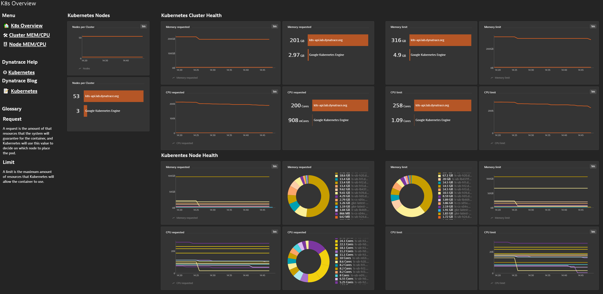
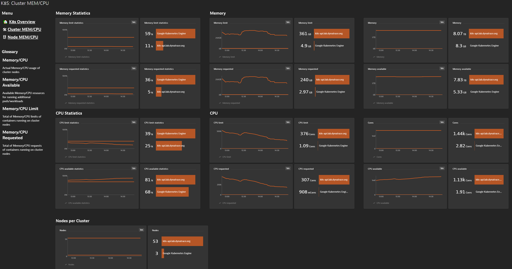
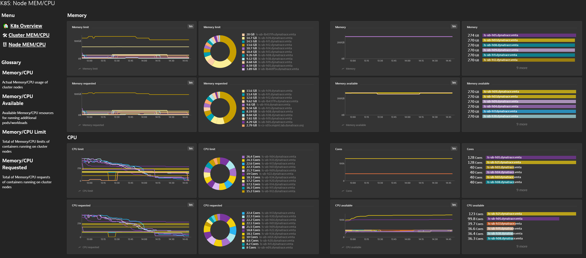

# Cloud_Integrated_Metric_Dashboards-CIMD-
The cloud integrated metric dashboards will help close any gaps in visibility of the metrics for customers

# Requirements
Install the required modules running 'pip install -r stable-req.text'

# Get Started
Provide the tenant/environment url, api-token and username params in the auth_param_example.yaml file found in etc/. **Rename the file to auth_param.yaml.**

tenant/environment url  
managed: https://{your-domain}/e/{your-environment-id}  
saas:  https://{your-environment-id}.live.dynatrace.com
NOTE: the tenant url should not end with a '/'.  

api-token
The api token should have the following permissions: Read configuration and Write configuration

username params
Should match the username presented within the Dynatrace UI. This user will become the owner of these dashboards. You can also define the way these dashboards are shared, publicly/privately.

# Executing
python importdash.py --idash {cloud_technology} - aws/azure/k8s/cloudfoundry/vmware

NOTE: May take some time to publish the dashboards to your environment

#Screenshots

Each dashboard contains an overview landing page to showcase some key integrated metrics of the cloud platform.

Granular dashboard highlighting a component of the cloud platform in this case Kubernetes Cluster

Granular dashboard highlighting a component of the cloud platform in this case Kubernetes Node
